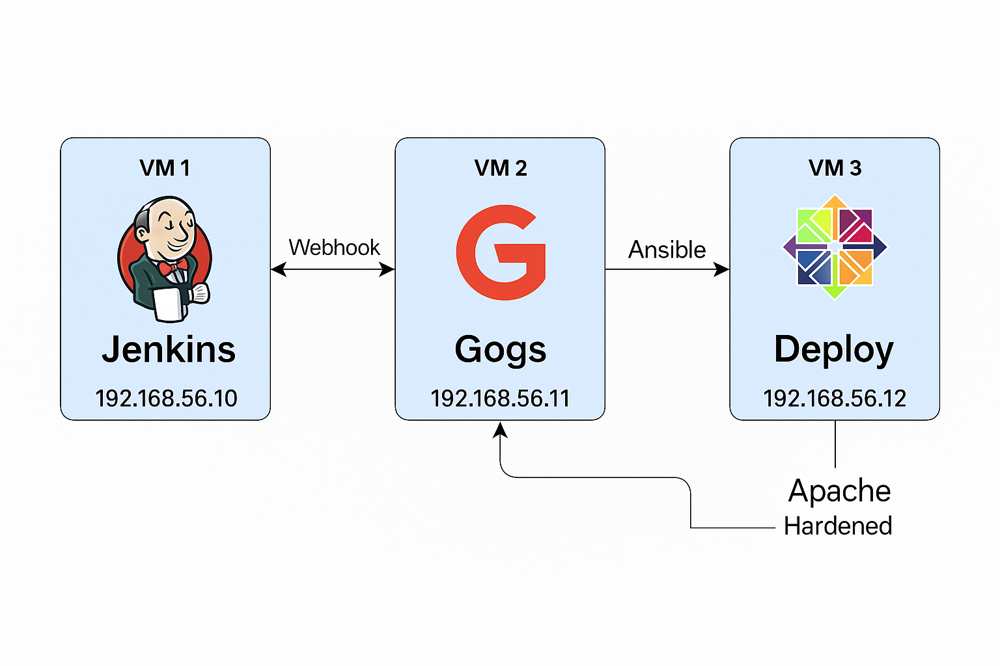

# DevOps Infrastructure Automation & Hardening Project

## Overview
This project showcases a complete infrastructure automation and system hardening pipeline using **Vagrant-provisioned CentOS VMs**, Ansible for configuration management, and Jenkins for CI/CD integration. The entire setup is performed on a local environment to simulate production-grade DevOps practices.


## VM Architecture

- **VM1 (Jenkins)**: Orchestrates CI/CD with Ansible and Docker builds.
- **VM2 (Gogs)**: Self-hosted Git server with webhooks triggering Jenkins.
- **VM3 (Deploy Server)**:
  - Receives automated Apache deployment
  - Hardened Linux configuration
  - Hosts user management scripts

## Repo Structure
```
devops-infra-hardening-pipeline/
├── Vagrantfile
├── jenkins
│	└── Jenkinsfile
├── ansible
│	└── deploy.yml
│	└── roles/
│		└── apache_setup/
│                       └── tasks/
│                           │   └── main.yml
│                           ├── handlers/
│                           │   └── main.yml
│                           ├── files/
│                           │     └── index.html
│                           └── templates/
│   
├── scripts
│	└── CreateUsersAd.sh
│	├── NotGroupMembers.sh
│	├── services_status.sh
│	└── check_disk_usage	
│
├── Dockerfile
├── entrypoint.sh
├── architecture.png
├── screenshots/
│   ├── jenkins_success.png
│   ├── apache_403.png
│   ├── audit_logs.png
│   ├── git_repo.png
│   ├── curl_from_jenkins.png
│   ├── disk_and_user_creation_alerts.png
│   ├── service_status_script.png
│   └── services_masked.png
└── README.md
```

---

## VM3 (Deploy Server) - Hardening & Automation

### Ansible Role: `apache_setup`
- Installs and hardens Apache
- Changes root to `/srv/www`
- Allows access from Jenkins IP only (`192.168.56.10`)
- Adds headers, disables `ServerTokens/Signature`
- Custom logs + logrotate

### Bash Scripts
- **CreateUsersAd.sh**: Creates `Devo`, `Testo`, `Prodo` with `/bin/rbash`, SSH-only, logs to `/var/log/deploy_user_creation.log`.
- **NotGroupMembers.sh**: Shows users outside `deployG`, with UID, shell, last login.
- **services_status.sh**: Lists enabled systemd services with memory usage.
- **check_disk_usage**: Logs to `/var/log/deploy_alerts.log` if `/` exceeds 80%.

### System Hardening
- **Firewall**: Only SSH (22) and Apache (80) open.
- **Masked services**: `cups`, `postfix`, `avahi-daemon`.
- **auditd**: Tracks changes in `/srv/www`, `/etc/passwd`, `/etc/group`.
- **cron**: Hourly check of disk usage.

---

## Jenkinsfile Stages
1. **SCM Trigger**: Triggered by webhook on Gogs.
2. **Ansible Playbook**: Applies `deploy.yml` against VM3.
3. **Docker Image**:
   - Build using `Dockerfile`
   - Saves `.tar` file `nginx-custom.tar`
4. **Email Notification**:
   - Sends build status
   - Lists users in `deployG`
   - Execution timestamp
   - `.tar` path

---

## Screenshots 
| Filename | Description |
|----------|-------------|
| `jenkins_success.png` | Successful Jenkins pipeline run |
| `apache_403.png` | 403 Forbidden response from non-Jenkins IP |
| `audit_logs.png` | Auditd showing change to `/srv/www` |
| `disk_and_user_creation_alerts.png` | Disk usage alert logged |
| `services_masked.png` | Systemd services like postfix masked |
| `git-repo.png` | The gogs repo |
| `curl_from_jenkins.png` | Shows the successful curl from the jenkins vm |
| `service_status_script.png` | Shows memory usage for each service |

---

## Architecture Diagram


---

**Author:** Tarek Zaki  
**Email:** <tareki9100@gmail.com>  
**GitHub Repo:** https://github.com/Tarek9100/devops-infra-hardening-pipeline
